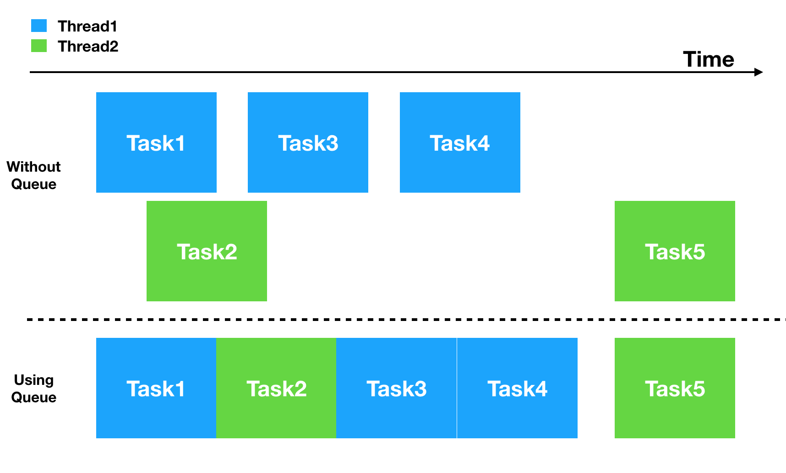

# SimpleTaskQueue

A handy way to execute tasks sequentially even across different threads. gurantee only one task is running at a time. 



>TaskQueues do not care about threads, the sole purpose of a queue is to make sure that its tasks run sequentially and ensures that only one task is running at a time.


## Example
This example simulates input backpressure by starting 20 tasks almost at the same time, our goal is to make sure this tasks doesn't interscet with each other.
```swift
// Simulating 20 rapid events that trigger random length tasks
let queue = TaskQueue.getQueue(identifier: "Test")   // 1
_ = (1...20).map {
        queue.push(task: TestTask(tag: "RandomTask\($0)"))  // 2
}
        
// Replay events happened to the queue after sometime
DispatchQueue.main.asyncAfter(deadline: .now() + 100) {
    queue.recorder.reply()   // 3
}
        
print("Hi, MainThread is not blocked by tasks!!")
```

```swift
struct TestTask: Task {   // 4
    var tag: String
    func execute(queueLock: QueueLock) {    // 5
        DispatchQueue.main.asyncAfter(deadline: .now() + Double.random0to10()) {
            queueLock.release()   // 6
        }
    }
}
```
**Output:**
```sh
Hi, MainThread is not blocked by tasks!!
13:49:20: Task RandomTask1 pushed to queue
13:49:20: Task RandomTask1 started - accuired lock
13:49:20: Task RandomTask2 pushed to queue
13:49:20: Task RandomTask3 pushed to queue
13:49:20: Task RandomTask4 pushed to queue
13:49:20: Task RandomTask5 pushed to queue
13:49:20: Task RandomTask6 pushed to queue
13:49:20: Task RandomTask7 pushed to queue
13:49:20: Task RandomTask8 pushed to queue
13:49:20: Task RandomTask9 pushed to queue
13:49:20: Task RandomTask10 pushed to queue
13:49:20: Task RandomTask11 pushed to queue
13:49:20: Task RandomTask12 pushed to queue
13:49:20: Task RandomTask13 pushed to queue
13:49:20: Task RandomTask14 pushed to queue
13:49:20: Task RandomTask15 pushed to queue
13:49:20: Task RandomTask16 pushed to queue
13:49:20: Task RandomTask17 pushed to queue
13:49:20: Task RandomTask18 pushed to queue
13:49:20: Task RandomTask19 pushed to queue
13:49:20: Task RandomTask20 pushed to queue
13:49:21: Task RandomTask1 finished - released lock
13:49:21: Task RandomTask2 started - accuired lock
13:49:27: Task RandomTask2 finished - released lock
13:49:27: Task RandomTask3 started - accuired lock
13:49:34: Task RandomTask3 finished - released lock
13:49:34: Task RandomTask4 started - accuired lock
13:49:35: Task RandomTask4 finished - released lock
13:49:35: Task RandomTask5 started - accuired lock
13:49:44: Task RandomTask5 finished - released lock
13:49:44: Task RandomTask6 started - accuired lock
13:49:52: Task RandomTask6 finished - released lock
13:49:52: Task RandomTask7 started - accuired lock
13:49:55: Task RandomTask7 finished - released lock
13:49:55: Task RandomTask8 started - accuired lock
13:50:01: Task RandomTask8 finished - released lock
13:50:01: Task RandomTask9 started - accuired lock
13:50:03: Task RandomTask9 finished - released lock
13:50:03: Task RandomTask10 started - accuired lock
13:50:10: Task RandomTask10 finished - released lock
13:50:10: Task RandomTask11 started - accuired lock
13:50:15: Task RandomTask11 finished - released lock
13:50:15: Task RandomTask12 started - accuired lock
13:50:25: Task RandomTask12 finished - released lock
13:50:25: Task RandomTask13 started - accuired lock
13:50:29: Task RandomTask13 finished - released lock
13:50:29: Task RandomTask14 started - accuired lock
13:50:32: Task RandomTask14 finished - released lock
13:50:32: Task RandomTask15 started - accuired lock
13:50:37: Task RandomTask15 finished - released lock
13:50:37: Task RandomTask16 started - accuired lock
13:50:45: Task RandomTask16 finished - released lock
13:50:45: Task RandomTask17 started - accuired lock
13:50:46: Task RandomTask17 finished - released lock
13:50:46: Task RandomTask18 started - accuired lock
13:50:51: Task RandomTask18 finished - released lock
13:50:51: Task RandomTask19 started - accuired lock
13:50:53: Task RandomTask19 finished - released lock
13:50:53: Task RandomTask20 started - accuired lock
13:50:54: Task RandomTask20 finished - released lock
```
**Code Explanation:**

1. Get instance of the desired queue, queues are **singletons** identified by identifier string and can be careted using `TaskQueue.getQueue(identifier:)`. This method will check if there is a queue with this identifier alreqady exisits otheriwse it will create a new queue with this identifier.
2. **Push** tasks using `queue.push(task:)` to queue to execute them as soon as possible when all previous tasks in the queue are done.
3. When `queue.recorder.reply()` is called, it will print all events happened on the queue
4. Create a class/struct **conforming to `Task` protocol** to encapsulate the task's logic in it
5. **override execute** function and write the task logic
6. When the task is finished just **release the queue lock** by calling `queueLock.release()`, after that queue will automatically check if there are any pending tasks and start executing them.

## Usage

SimpleTaskQueue is useful to **avoid race conditions in situations where data sources are changing more rapidly than the consumer elements can consume**.  
One obvious example is when using a UICollectionView that displays data from an array of elements. If the array that is used by the datasource is changing rapidly, you might want to update the UI to reflect the new data but you don’t want the data to be modified again before you finish displaying it in the collection view to avoid any data inconsistency caused by race conditions.  
One solution is use locks but locks are dangerous if not used carefully because they may lead to a deadlock, another approach is to dispatch tasks synchronously into the main thread using DispatchQueue.main.sync but this is not a good idea because if you call this from the main thread it will block the main thread and most probably will led to a deadlock (The synchronous dispatch waits for the block to finish, but the block does not even start running, since we are waiting for the current one - the block that executes DispatchQueue.main.sync - to finish.).   
Using SimpleTaskQueue you can easily do this **by queuing different UI changes without blocking the main thread, we are just delaying the execution of one task till the other related tasks that use the same shared resources are finished**

### Installation

SimpleTaskQueue can be installed using CocoaPods
```sh
use_frameworks!
pod 'SimpleTaskQueue'
```

### Todos

 - Improve logging by adding interactive replays
 - Add callbacks to different queue states

License
----

MIT
